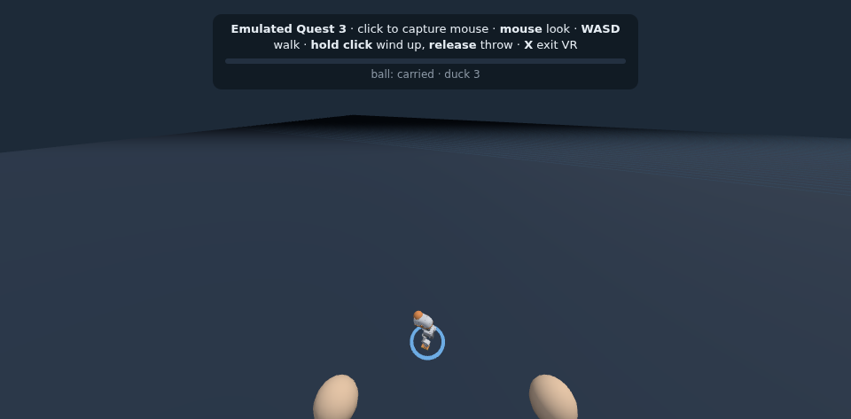
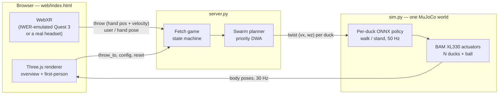

# microduck_vr

**Throw a virtual ball in VR. A swarm of simulated [Microduck](https://github.com/pollen-robotics/microduck) robots fetches it and brings it back to you.**

The prototype runs entirely on a PC. You don't need a headset or real robots: the browser emulates a Meta Quest 3, and the robots are simulated in MuJoCo, each driven by Pollen Robotics' pretrained walking policy.



> **Status:** research prototype. Tested in simulation and on an emulated Quest 3 only.

---

## Contents

1. [Features](#features)
2. [Quick start](#quick-start)
3. [Controls](#controls)
4. [How it works](#how-it-works)
5. [Configuration](#configuration)
6. [WebSocket protocol](#websocket-protocol)
7. [Testing](#testing)
8. [Repository layout](#repository-layout)
9. [Known limitations](#known-limitations)
10. [Credits and licenses](#credits-and-licenses)

---

## Features

- **Swarm fetch game:** throw the ball and the nearest duck is dispatched before it even lands. It picks the ball up, carries it back, and hands it to you. The other ducks escort it on the way out, then park beside you.
- **Physically simulated robots:** all ducks and the ball share one MuJoCo world. Each duck runs the pretrained ONNX walking and standing policies on the BAM XL330 servo model, the same setup the policies were trained with.
- **Collision-free swarm motion:** a priority-based Dynamic Window Approach planner keeps the ducks apart while they walk. It is tuned to the walking policy's real limits: it needs a minimum forward speed and can't turn in place.
- **VR without a headset:** [IWER](https://github.com/meta-quest/immersive-web-emulation-runtime) emulates a Quest 3 in the browser, so the real WebXR code runs (headset pose, controller trigger, throw velocity measured from hand motion). The same page works on a real headset.
- **No training required:** everything uses Pollen's released policies. The coordination layer is a hand-designed controller, not a learned one.

---

## Quick start

### Requirements

| | |
|---|---|
| OS | Linux (tested on Ubuntu 22.04, x86_64) |
| Python tooling | [uv](https://docs.astral.sh/uv/) |
| Browser | Chrome or another Chromium-based browser (needs WebXR support) |
| GPU | Not required. Everything runs on the CPU. |

### 1. Get the Microduck simulation assets

This repo reuses the robot model, the actuator model, and the pretrained policies from [pollen-robotics/microduck_rl](https://github.com/pollen-robotics/microduck_rl). They aren't copied into this repo because the 3D models are licensed CC BY-SA-NC. Clone it **next to** this repo:

```bash
mkdir vrduck && cd vrduck
git clone https://github.com/dongheonh/microduck_vr
git clone https://github.com/pollen-robotics/microduck_rl

cd microduck_rl
uv sync                                   # Python 3.12 environment (~2 GB of wheels on first run)
uv run python -c "
from huggingface_hub import hf_hub_download
for f in ('alpha_walking.onnx', 'alpha_stand.onnx'):
    hf_hub_download('pollen-robotics/microduck-policies', f, local_dir='policies')
"
cd ..
```

Expected layout:

```
vrduck/
├── microduck_vr/      # this repo
└── microduck_rl/      # Pollen's repo + .venv + policies/
```

If `microduck_rl` lives somewhere else, set `MICRODUCK_RL_DIR=/path/to/microduck_rl`.

### 2. Start the server

```bash
cd microduck_vr
../microduck_rl/.venv/bin/python server.py --ducks 5
```

```
[vrduck] 5 ducks | open http://localhost:8000  (ws :8765)
```

> **ROS users:** if a ROS 2 setup script is sourced in your shell, its `PYTHONPATH` breaks the environment. Prefix commands with `env -u PYTHONPATH`.

### 3. Open the app

Go to **http://localhost:8000**. The first load takes a few seconds because the robot meshes are about 10 MB.

---

## Controls

### Overview mode (default)

| Input | Action |
|---|---|
| Click on the floor | Throw the ball to that spot |
| Shift + click | Move yourself (the ducks deliver to you) |
| Drag / mouse wheel | Orbit / zoom the camera |
| **Speed** slider | Simulation speed (0.5–4×). The ducks walk at about 0.1 m/s, so 2× is the default. |
| **Swarm escorts the fetcher** | Toggle whether the other ducks follow the fetcher |
| **Reset** | Put the ducks back in their starting grid and give you the ball |

### First-person VR (emulated Quest 3)

Click **ENTER VR** at the bottom of the page, then click once inside the view to capture the mouse.

| Input | Action |
|---|---|
| Mouse | Look around |
| W A S D | Walk |
| **Hold** left click | Grab the ball and wind up (hold longer to throw harder) |
| **Release** left click | Throw |
| X | Exit VR |

The power bar at the top shows how hard you'll throw. The ball follows your hand while you hold it, and the ducks bring it back to wherever you're standing.

### Page options (URL parameters)

| URL | Effect |
|---|---|
| `http://localhost:8000/?lite` | No shadows, half resolution. Use this on slow GPUs; the HUD shows the frame rate. |
| `http://localhost:8000/?native` | Use a real WebXR headset instead of the emulator |

---

## How it works



Each duck takes exactly one input: a **twist command** (forward speed, turn rate). That is the same interface a real Microduck's runtime accepts, so the planner could later drive physical robots unchanged.

### 1. Simulation (`sim.py`)

- **World:** N copies of `robot_walk.xml` are attached into one MuJoCo world (name prefixes `d0_`, `d1_`, …), plus a 35 mm ball and a floor.
- **Control loop:** every 20 ms (50 Hz), each duck builds its 61-value observation and runs the **walking** policy, or the **standing** policy when its command is near zero. The resulting joint targets drive the BAM XL330 actuator model through 4 physics substeps of 5 ms.
- **Ball pickup is virtual:** once a duck reaches the ball, the ball is pinned to its beak. (Microducks have no arms, and in VR the ball is virtual anyway.)
- **Falls:** a fallen duck is stood back up in place after 1.5 s (prototype shortcut).

### 2. Fetch game (`server.py`)

```
held ──throw──▶ flying ──lands──▶ ground ──duck reaches ball──▶ carried ──reaches user──▶ held
```

- **On release:** the landing point is predicted from the throw trajectory, and the **nearest duck** is dispatched right away.
- **Ball on the ground:** the fetcher walks to where the ball actually stopped (it may roll).
- **Delivery:** the fetcher stops 0.25 m in front of you and the ball goes back to your hand.
- **Other ducks:** they escort the fetcher on the way out (optional), then park in a grid to your left, out of the delivery lane.

### 3. Swarm planner (`server.py`)

The ducks are **not** free to move in any direction. The pretrained walking policy has quirks, measured in the simulation:

| Quirk | Consequence |
|---|---|
| Won't start walking from a standstill with a small forward command | Moving ducks always get at least 0.25 forward, plus a 0.5 s start-up kick at 0.3 |
| Can barely turn in place | Ducks turn on arcs while walking |
| Actual speed ≈ 0.37 × commanded; turn rate ≈ 0.55 × commanded | The planner predicts motion with these measured gains |

So instead of assuming ducks can move in any direction, the planner uses a **Dynamic Window Approach** (Fox, Burgard & Thrun, 1997) adapted for a swarm:

1. **Candidates:** every 0.1 s, each duck considers 22 commands: stop, or one of 3 forward speeds × 7 turn rates.
2. **Prediction:** each candidate is simulated 1.5 s ahead using the measured motion model above.
3. **Safety check:** a candidate is rejected if it would bring the duck within **0.22 m** of another duck, or 0.16 m when the fetcher is involved.
4. **Choice:** among the rest, the duck picks the one that makes the most progress toward its goal while ending up facing it.
5. **Priority:** the fetcher plans first and shares the path it *wants* to take. Lower-priority ducks treat that path as an obstacle and step aside, which prevents the fetcher and a parked duck from waiting on each other forever.
6. **Jam breakers:**
   - A duck that is already too close to another must actively move away; standing still isn't allowed.
   - A duck that has been blocked for 2 s may squeeze past at 65 % of the safety distance (about 14 cm, still clear of contact).

### 4. Client (`web/index.html`)

- **Rendering:** the server sends the robot meshes once, then streams every body's position and orientation at 30 Hz. The page only draws them; no robot kinematics run in the browser.
- **VR throw:** the page measures the throw the way a real headset app would.
  - Pressing the trigger grabs the ball.
  - On release, the throw velocity is the hand's velocity over its last ~100 ms of motion.
  - While held, the ball follows the tracked hand.
- **Emulator:** mouse and keyboard drive IWER's virtual headset and right controller. At low frame rates the emulated swing is stretched over at least 5 frames at the same hand speed, so throw strength doesn't depend on the frame rate.
- **Speed cap:** the server limits throws to 4 m/s, about 2.5 m of range, because the ducks are slow.

---

## Configuration

### Server flags

```bash
../microduck_rl/.venv/bin/python server.py [flags]
```

| Flag | Default | Description |
|---|---|---|
| `--ducks` | `5` | Number of ducks (5–8 tested) |
| `--time-scale` | `2.0` | Simulation speed relative to real time (also adjustable in the page) |
| `--fps` | `30` | Pose streaming rate to the browser |
| `--http-port` | `8000` | Web page port |
| `--ws-port` | `8765` | WebSocket port |

### Environment variables

| Variable | Default | Description |
|---|---|---|
| `MICRODUCK_RL_DIR` | `../microduck_rl` | Path to the `microduck_rl` checkout (robot XML, BAM, `policies/`) |

### Tunable constants (top of `server.py`)

| Constant | Value | Meaning |
|---|---|---|
| `SAFE_DIST` | 0.22 m | Minimum distance between duck centers |
| `SAFE_DIST_FETCHER` | 0.16 m | Minimum distance involving the fetcher |
| `SLOT_SPACING` | 0.35 m | Spacing of the parking grid |
| `PICKUP_DIST` | 0.11 m | How close a duck must get to pick up the ball |
| `DELIVER_OFFSET` | 0.25 m | Where the fetcher stops in front of you |
| `MAX_THROW_SPEED` | 4.0 m/s | Throw speed cap |
| `HORIZON_S` / `PLAN_PERIOD` | 1.5 s / 0.1 s | Planner look-ahead and replanning period |

---

## WebSocket protocol

The server listens on `ws://<host>:8765`. All positions are in the simulation's world frame: meters, **z up**.

**Client → server** (JSON)

| Message | Purpose |
|---|---|
| `{"type": "throw", "pos": [x,y,z], "vel": [vx,vy,vz]}` | Release the ball with this position and velocity (VR) |
| `{"type": "throw_to", "target": [x,y]}` | Lob the ball to a floor point (overview mode) |
| `{"type": "user", "pos": [x,y], "yaw": rad}` | Where the user stands (the delivery point) |
| `{"type": "hand", "pos": [x,y,z] \| null}` | Tracked hand position; the held ball follows it |
| `{"type": "config", "time_scale": 2.0, "escort": true}` | Change settings |
| `{"type": "reset"}` | Reset ducks and ball |

**Server → client**

1. On connect: one JSON `scene` message with the meshes (base64 float32/uint32) and visual geometry per body.
2. Then, every frame:
   - a JSON `state` message (ball state, fetcher, predicted landing point, duck positions and commands, event log);
   - a binary `Float32Array` of all body poses, `nbody × [x, y, z, qw, qx, qy, qz]`.

Slow clients skip frames instead of slowing down the simulation.

---

## Testing

Run from the repo root with the `microduck_rl` environment:

```bash
PY=../microduck_rl/.venv/bin/python

$PY test_fetch.py 5         # 12 fixed throws in different directions
$PY stress_test.py 5 8      # random idle times + random throws, 3 seeds per swarm size
$PY e2e_vr_test.py          # headless Chrome: emulated-VR throws end to end (server must be running)
```

Latest results:

| Test | Result |
|---|---|
| `test_fetch.py 5` | 12/12 throws delivered, 13–40 s of simulated time each |
| `stress_test.py 5` | 18/18 delivered; closest two ducks ever got: 12 cm |
| `stress_test.py 8` | 17/18 delivered; closest pair 6.6 cm |
| `e2e_vr_test.py` (holds of 250 / 600 / 1000 ms) | 3/3 landed in front of the user (1.0 / 1.8 / 2.8 m) and were fetched back |

---

## Repository layout

```
microduck_vr/
├── server.py              # fetch game, swarm planner (DWA), WebSocket + HTTP server
├── sim.py                 # shared-world MuJoCo sim: N ducks + ball, ONNX policies, BAM actuators
├── web/
│   └── index.html         # Three.js client, WebXR, IWER Quest 3 emulator
├── test_fetch.py          # fixed-throw regression test
├── stress_test.py         # randomized stress test
├── e2e_vr_test.py         # headless-Chrome end-to-end VR test
├── docs/                  # README images
└── microduck_rl_scripts/  # standalone demo scripts for the microduck_rl repo (see its README)
```

`microduck_rl_scripts/` contains three earlier experiments that run inside `microduck_rl` itself: a single-duck demo video, a 20-duck swarm video, and 20 ducks walking as a group in a chosen direction. See [its README](microduck_rl_scripts/README.md).

---

## Known limitations

- **No body collisions:** the walking model has collision shapes on the feet only, so ducks can visually pass through each other. The planner alone keeps them apart.
- **Slow robots:** the ducks walk at about 0.1 m/s, so a fetch takes 13–40 s of simulated time (about 7–20 s on screen at 2×).
- **Swarm size:** 5 ducks are reliable; 8 ducks occasionally fail to finish a fetch.
- **Real headset not tested:** a real Quest needs the page over **HTTPS** and the socket over **`wss://`** (browsers block `ws://` from an HTTPS page). This isn't set up yet.
- **Large first download:** the scene message is about 10 MB of full-detail meshes. Simplify the meshes before streaming over Wi-Fi.
- **Fall recovery is faked:** fallen ducks are reset in place instead of standing up with a recovery policy.

---

## Credits and licenses

- **[pollen-robotics/microduck_rl](https://github.com/pollen-robotics/microduck_rl):** robot model, BAM actuator setup, and training environments. Code is Apache-2.0; 3D models are **CC BY-SA-NC**. Not included in this repo.
- **[pollen-robotics/microduck-policies](https://huggingface.co/pollen-robotics/microduck-policies):** pretrained walking and standing policies.
- **[MuJoCo](https://mujoco.org/)**, **[BAM](https://github.com/Rhoban/bam)** (actuator model), **[Three.js](https://threejs.org/)**, **[IWER](https://github.com/meta-quest/immersive-web-emulation-runtime)** (WebXR emulation).
- Dynamic Window Approach: D. Fox, W. Burgard, S. Thrun, *"The Dynamic Window Approach to Collision Avoidance"*, IEEE Robotics & Automation Magazine, 1997.

This repository does not have a license file yet.
